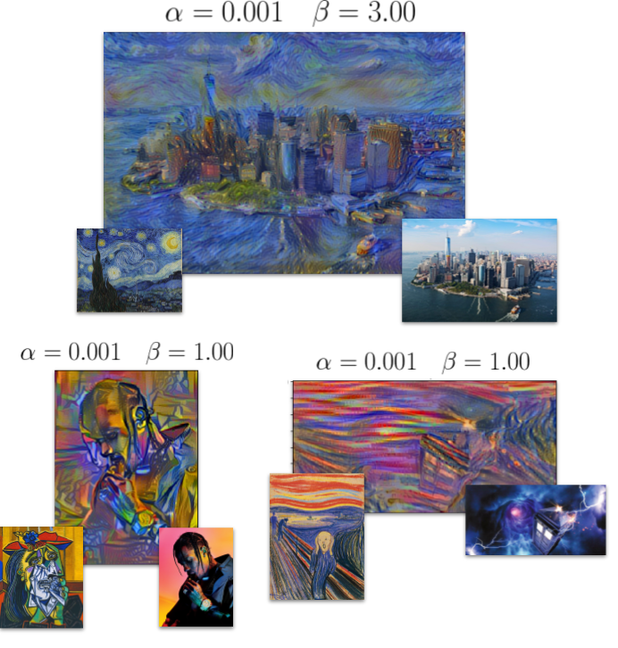

# Image Style Transfer on Tensorflow

This is a Tensorflow implementation of the paper "Image Style Transfer Using Convolutional Neural Networks" by Gatys et al.
The authors used the L-BFGS optimizer but since it is not available on Tensorflow, we decided to use ADAM.

## Requirements

There is a `requirements.txt` you can use. As it is stated, the code was tested on `tensorflow-gpu==1.5`.
You also have to download VGG pretrained models. For this, you can use the script `get_models.sh`.

```shell
pip install -r requirements.txt
./get_models.sh
```

## Usage

There is a notebook (`notebook.ipynb`) you can use to test the implementation.
You can use the recommend values `n_steps=1000`, `learning_rate=5` but you are supposed to tune `alpha` and `beta` for better results.
You can fix `alpha` and only try different values for `beta`.
In addition, we implemented the total variation denoising.
You can use it by setting a positive value to `tv_weight`.

It was tested on a NVIDIA GTX 1070 graphics card and it takes approximately 4-5 min to get the output.
Note we resize the input image if it is too large to reduce the runtime.

## Results



## References

[1](https://www.cv-foundation.org/openaccess/content_cvpr_2016/papers/Gatys_Image_Style_Transfer_CVPR_2016_paper.pdf) L. A. Gatys and A. S. Ecker and M. Bethge, Image Style Transfer Using Convolutional Neural Networks, CVPR, 2016.
